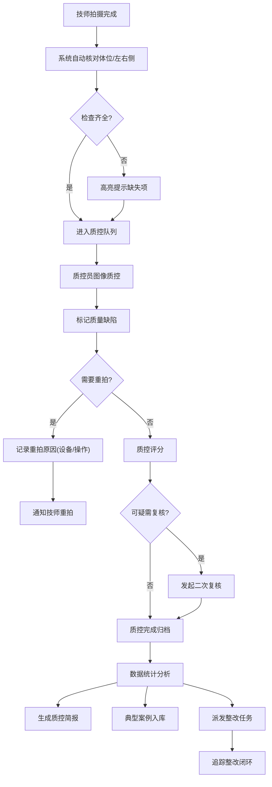

## 1. 产品概述
面向乳腺影像科技师长与质控员的 Web 质控工作台，专门管理乳腺 DR 从拍摄到报告前的全流程质量把关。
- 核心价值：通过标准化质控流程降低重拍率、提升检查质量、形成科室质控闭环管理
- 目标用户：乳腺影像科技师长、质控员、技师

## 2. 核心功能

### 2.1 用户角色
| 角色 | 注册方式 | 核心权限 |
|------|----------|----------|
| 科室管理员/质控员 | 院内账号 | 全模块访问、规则设置、质控评分、简报生成、整改追踪 |
| 技师 | 院内账号 | 检查队列查看、自检提交、案例学习 |
| 科室主任 | 院内账号 | 科室看板、统计分析、简报查阅 |

### 2.2 功能模块
1. **科室看板**：质控概览、合格率趋势、重拍率统计、待办事项
2. **检查队列**：当日检查列表、状态追踪、快速质控入口、二次复核列表
3. **图像质控**：左右侧/体位自动核对、CC/MLO成套检查、质量缺陷标记、重拍原因记录、质控评分
4. **问题复盘**：重拍统计、缺陷分布、技师对比、机房分析、典型案例库、整改追踪
5. **规则设置**：质控规则配置、评分表维护、缺陷类型管理、通知设置

### 2.3 页面详情
| 页面名称 | 模块名称 | 功能描述 |
|----------|----------|----------|
| 科室看板 | 数据概览卡片 | 今日检查量、合格率、重拍率、待质控数、复核中数量实时展示 |
| 科室看板 | 趋势图表 | 近7日/30日合格率趋势、重拍率趋势折线图 |
| 科室看板 | 缺陷Top排行 | 高频缺陷类型柱状图、技师合格率排名 |
| 科室看板 | 待办列表 | 待质控、待复核、待整改事项快速入口 |
| 检查队列 | 筛选查询 | 按日期、技师、机房、状态、患者信息筛选 |
| 检查队列 | 检查列表 | 患者信息、检查时间、技师、机房、体位完成度、质控状态标签 |
| 检查队列 | 快捷操作 | 快速质控、发起复核、查看详情 |
| 图像质控 | 体位核对面板 | 左右侧标识核对、CC/MLO体位成套检查、缺失项高亮提示 |
| 图像质控 | 缺陷标记 | 皮肤皱褶、乳头未侧位、胸大肌不足、后组织覆盖不足等常见缺陷一键标记 |
| 图像质控 | 重拍登记 | 选择重拍原因（设备问题/操作问题）、备注说明 |
| 图像质控 | 院内评分表 | 内置质控评分表、逐项打分、自动计算总分 |
| 图像质控 | 二次复核 | 对可疑图像发起复核、指定复核人、记录复核意见 |
| 问题复盘 | 统计分析 | 按技师合格率/重拍率排名、按机房高频缺陷统计、缺陷类型分布饼图 |
| 问题复盘 | 典型案例库 | 不合格案例归档、案例分类、查看详情、班前培训模式 |
| 问题复盘 | 整改追踪 | 整改任务派发、整改进度追踪、整改闭环确认 |
| 问题复盘 | 质控简报 | 按日/周/月生成质控简报、支持导出 |
| 规则设置 | 质控规则 | 体位要求配置、缺陷类型管理、评分标准维护 |
| 规则设置 | 通知设置 | 重拍提醒、复核通知、整改提醒的通知方式配置 |
| 规则设置 | 人员管理 | 技师信息、机房信息、角色权限维护 |

## 3. 核心流程
技师完成乳腺DR拍摄后，系统自动核对左右侧标识与体位完整性。质控员进入图像质控模块，系统提示潜在质量问题，质控员标记缺陷、判断是否重拍并区分原因类型，填写质控评分。对可疑图像发起二次复核。问题复盘模块对质控数据进行多维度统计分析，生成质控简报，派发整改任务并追踪闭环。典型不合格案例纳入案例库供班前培训。

## 4. 用户界面设计
### 4.1 设计风格
- **主色调**：专业医疗蓝 (#1E6FD9) 作为主色，搭配深空灰 (#2C3E50) 作为辅助色
- **强调色**：状态指示用绿色 (#27AE60) 合格、橙色 (#F39C12) 警告、红色 (#E74C3C) 不合格/重拍
- **按钮风格**：圆角矩形按钮，主要操作使用填充式主色按钮，次要操作使用描边按钮
- **字体**：使用 "PingFang SC"、"Microsoft YaHei" 作为中文主字体，数字和英文使用系统等宽字体
- **布局风格**：顶部导航 + 左侧菜单 + 内容区的经典后台布局，卡片式信息展示，数据表格为主
- **图标风格**：线性医疗风格图标，简洁清晰，避免过度装饰

### 4.2 页面设计概览
| 页面名称 | 模块名称 | UI元素 |
|----------|----------|--------|
| 科室看板 | 数据概览卡片 | 白底卡片、图标+数字、趋势小箭头、状态色边框 |
| 科室看板 | 图表区域 | ECharts图表、浅蓝色背景、渐变折线/柱状图 |
| 检查队列 | 数据表格 | 斑马纹行、状态标签彩色圆角、行悬停高亮、操作按钮组 |
| 图像质控 | 左右侧核对面板 | 双栏布局、绿色✓/红色✗状态指示、缺失项红色边框闪烁 |
| 图像质控 | 缺陷标记区 | 缺陷类型卡片、点击选中边框高亮、多选支持 |
| 问题复盘 | 统计图表 | 多标签页切换、饼图/柱状图/条形图组合、悬停详情提示 |
| 问题复盘 | 案例库 | 卡片网格布局、案例缩略图、标签分类、悬停放大预览 |
| 规则设置 | 配置表单 | 分组折叠面板、开关控件、下拉选择、保存按钮固定底部 |

### 4.3 响应式
- 桌面优先设计，支持1280px及以上分辨率
- 主要适配1920x1080科室工作站屏幕
- 表格区域支持水平滚动，小屏幕下侧栏可折叠

## 5. 数据模型概要
- **检查记录**：患者ID、检查时间、技师、机房、体位(CC左/CC右/MLO左/MLO右)、质控状态、评分、缺陷列表
- **缺陷类型**：缺陷编码、名称、分类(体位/图像/标识)、严重程度、是否导致重拍
- **重拍记录**：检查ID、重拍原因(设备/操作)、具体原因、备注、处理人
- **复核记录**：检查ID、发起人、复核人、复核意见、复核状态
- **整改任务**：任务ID、关联缺陷、责任人、整改要求、截止日期、整改状态、完成证明
- **典型案例**：案例ID、检查ID、缺陷类型、案例描述、教学价值、创建时间
