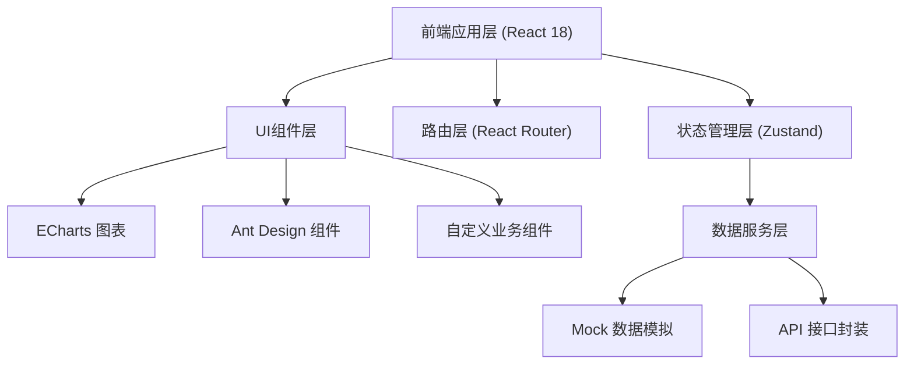

## 1. 架构设计



## 2. 技术描述
- **前端框架**：React@18 + TypeScript@5 + Vite@5
- **UI组件库**：Ant Design@5
- **图表库**：ECharts@5
- **状态管理**：Zustand@4
- **路由管理**：React Router@6
- **样式方案**：Tailwind CSS@3
- **日期处理**：Day.js
- **数据**：使用 Mock 数据模拟，无后端服务
- **代码规范**：ESLint + Prettier

## 3. 目录结构

```
src/
├── assets/              # 静态资源
├── components/        # 公共组件
│   ├── layout/       # 布局组件
│   ├── common/     # 通用组件
├── pages/          # 页面模块
│   ├── Dashboard/      # 科室看板
│   ├── Queue/          # 检查队列
│   ├── QualityControl/  # 图像质控
│   ├── Review/       # 问题复盘
│   └── Settings/     # 规则设置
├── store/          # 状态管理
├── mock/           # Mock数据
├── types/          # TypeScript类型定义
├── utils/          # 工具函数
├── router/         # 路由配置
├── App.tsx
├── main.tsx
└── index.css
```

## 4. 路由定义
| 路由路径 | 页面组件 | 功能说明 |
|-----------|----------|----------|
| / | Dashboard | 科室看板首页 |
| /queue | Queue | 检查队列 |
| /quality/:id | QualityControl | 图像质控详情 |
| /review/statistics | ReviewStatistics | 问题复盘-统计分析 |
| /review/cases | ReviewCases | 问题复盘-典型案例库 |
| /review/rectification | ReviewRectification | 问题复盘-整改追踪 |
| /review/report | ReviewReport | 问题复盘-质控简报 |
| /settings/rules | SettingsRules | 规则设置-质控规则 |
| /settings/notification | SettingsNotification | 规则设置-通知设置 |
| /settings/staff | SettingsStaff | 规则设置-人员管理 |

## 5. 数据模型

### 5.1 类型定义

```typescript
// 检查记录
interface Examination {
  id: string;
  patientId: string;
  patientName: string;
  patientAge: number;
  examTime: string;
  technician: string;
  room: string;
  positions: {
    ccLeft: boolean;
    ccRight: boolean;
    mloLeft: boolean;
    mloRight: boolean;
  };
  status: 'pending' | 'qc_pending' | 'qc_passed' | 'qc_failed' | 'rechecking' | 'retake' | 'completed';
  score: number;
  defects: string[];
  needRetake: boolean;
  retakeType?: 'equipment' | 'operation';
  retakeReason?: string;
  recheckRequested: boolean;
  recheckOpinion?: string;
}

// 缺陷类型
interface DefectType {
  id: string;
  code: string;
  name: string;
  category: 'position' | 'image' | 'marker';
  severity: 'minor' | 'major' | 'critical';
  causeRetake: boolean;
}

// 技师统计
interface TechnicianStats {
  id: string;
  name: string;
  totalExams: number;
  passRate: number;
  retakeRate: number;
  defectCount: Record<string, number>;
}

// 整改任务
interface RectificationTask {
  id: string;
  title: string;
  relatedExamId: string;
  defectType: string;
  responsible: string;
  deadline: string;
  status: 'pending' | 'in_progress' | 'completed';
  requirement: string;
  proof?: string;
}

// 典型案例
interface CaseStudy {
  id: string;
  examId: string;
  title: string;
  defectTypes: string[];
  description: string;
  teachingValue: string;
  createdAt: string;
  thumbnail: string;
}
```

### 5.2 Mock数据说明
系统使用 Mock 数据模拟真实业务场景，包含：
- 30条以上检查记录（覆盖各种质控状态）
- 常见缺陷类型库
- 5位技师的历史质控统计数据
- 3间机房的缺陷统计
- 若干整改任务和典型案例
- 质控评分表配置数据
